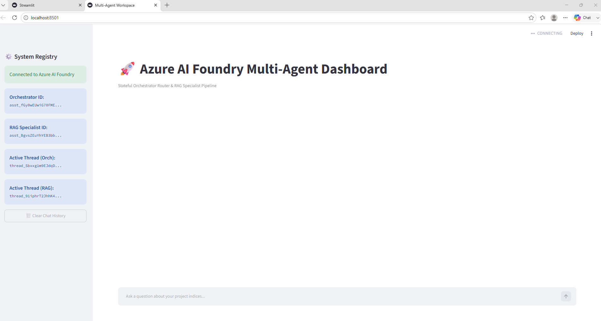

# Azure Async Multi-Agent Orchestrator

A high-performance, **asynchronous multi-agent orchestration framework** built on **Azure AI Foundry**.  
This system routes user queries to specialized AI agents (Orchestrator + RAG Specialist) while maintaining **stateful session context** through a Streamlit dashboard.

---

## Features

###  Async Core
- Built with `asyncio` for non-blocking agent execution
- High responsiveness for real-time user interaction

###  Multi-Agent Architecture
- **Orchestrator Agent**
  - Understands user intent
  - Applies routing logic and guardrails

- **RAG Specialist Agent**
  - Performs retrieval + analysis on structured/unstructured data
  - Uses secure sandbox via `CodeInterpreterTool`

###  Decoupled Design
- Clear separation between:
  - UI layer
  - Agent logic
  - Orchestration engine
  - Tool execution layer

###  Stateful UI
- Streamlit-based interactive dashboard
- Maintains session history and chat state

###  Azure Integration
- Designed for **Azure AI Foundry endpoints**
- Enterprise-ready deployment structure

---

##  Project Structure

```plaintext
azure-multi-agents/
│
├── app_ui.py               # Streamlit dashboard & state management
├── create_orchestrator.py  # Orchestrator agent initialization
├── create_rag_agent.py     # RAG specialist agent logic
├── run_chat_async.py       # Core asynchronous polling engine

├── deploy_orchestrator.py  # Azure AI Foundry deployment scripts
├── requirements.txt        # Project dependencies
└── .env                    # Environment / API configuration
```

#  Setup Instructions
1. Clone the Repository
```
 git clone https://github.com/Ghayas0772/azure-multi-agents.git
cd azure-multi-agents 

# 2. Create Virtual Environment
 python -m venv venv

# 3. Activate Environment
venv\Scripts\activate

# 4. Install Dependencies
pip install -r requirements.txt

#5. Configure Environment

Create a .env file:
PROJECT_ENDPOINT=your_endpoint_here
ORCHESTRATOR_ID=your_orchestrator_id_here
RAG_SPECIALIST_ID=your_rag_specialist_id_here
```

# Run the Application

Start the Streamlit dashboard
```
streamlit run app_ui.py
```
# Tech Stack
``` Python 3.12+
Azure AI Foundry (Agent Orchestration)
Streamlit (UI Dashboard)
AsyncIO (Concurrency Model)
CodeInterpreterTool (Secure Execution Sandbox)
```
## 📸 Multi-Agent System Demo Screenshots

This section shows the working flow of the Azure Multi-Agent RAG system, including system setup, agent orchestration, user interaction, and final response generation.

---

### 1. Project Directory Structure
Displays the overall project structure including agents, apps, core modules, and utilities.


---

### 2. Multi-Agent Architecture Connection
Shows successful initialization and linking of orchestrator and RAG specialist agents.


---

### 3. User Query in Streamlit UI
Demonstrates user interaction with the Streamlit chatbot interface where a query is submitted.

.png.png)

---

### 4. Final Response Output
Shows the final response generated by the multi-agent system after orchestration and processing.



# Purpose

This project is designed for:

Learning Azure AI agent orchestration
Building asynchronous AI systems
Understanding multi-agent routing patterns
Experimenting with RAG-based architectures
Developing production-style AI workflows
# Disclaimer

This is a research and learning project.
It is not optimized for production use and may include experimental implementations.

# Author

Ghayasudin Ghayas
MS Data Science | AI & Machine Learning Enthusiast
